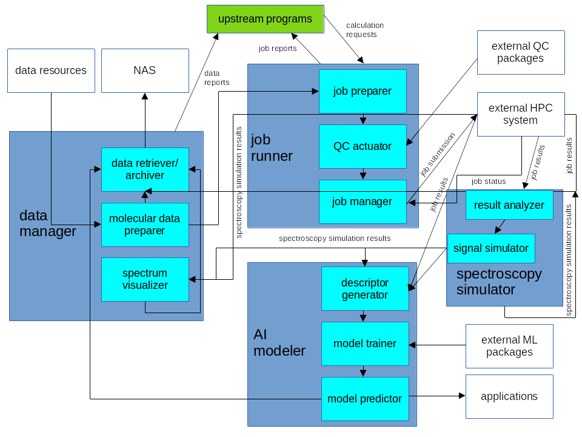

# General Design of the SpecAI Package

## Overview

SpecAI is a pacakge for spectroscopy simulation and chemical applications backed up by the AI technology. Currently it is designed to be the computing module of a large chemistry software system. However, it can also interact with people directly and run as a standing-alone simulation software. It is planned to cover almost all established spectroscopy techniques with broad ranges of chemical applications, which include but not limit to
- Vibrational spectroscopy
  - Infrared (IR) absorption
  - Optical Raman spectroscopy
- Valence electron spectroscopy
  - Ultraviolet-visible (UV-vis) absorption and emission
- Core electron spectroscopy
  - X-ray absorption (K-edge, L-edge, etc)
  - X-ray emission
  - Resonant Inelastic X-ray Scattering (RIXS)
- Magnetic Resonance Spectroscopy
  - Nuclear Magnetic Resonance (NMR)
  - Electron paramagnetic resonance (EPR) or electron spin resonance (ESR)
- Chiroptical Spectroscopy
  - Circular dichroism (CD)
    - Vibrational circular dichroism (VCD)
    - Electronical circular dichroism (ECD)
    - X-ray natural circular dichroism (XNCD)
    - X-ray magnetic circular dichroism (XMCD)
  - Optical activity (OA)
    - Optical Raman optical activity (ROA)
    - Vibrational optical activity (VOA)
- Multidimensional and nonlinear spesctroscopy
  - Multidimentional spectroscopy
    - Two-dimensional Infrared (2DIR) spectroscopy
    - Two-dimensional ultraviolet (2DUV) spectroscopy
  - Nonlinear and ultrafast spectroscopy
    - Two-photon absorption (TPA)
    - Four-wave mixing
    - Time-resolved X-ray absoprtion (TRXAS) or X-ray transient absorption spectroscopy (XTAS)

Some of the common spectroscopy signals, such as the IR and UV-vis absorption, can be simulated routinely using standard quantum chemistry packages. However, some signals are poorly supported by quantum chemistry packages (e. g., RIXS), or not supported at all (e. g., four-wave mixing). SpecAI aims at building a bridge between quantum chemistry theory and spectroscopy application. The users are not necessarily to be experts in both quantum chemistry and spectroscopy, but still can find the proper theoretical tool, correctly simulate the signals, nicely present the simulation results, and painlessly interpret the spectroscopy features. In addtion, high throughput calcualtion workflows will be implemented in SpecAI, which faciliate to generate big data of theoretical spectroscopy. Together with experiment data and popular machine learning (ML) packages such as PyTorch or TensorFlow, SpecAI can be used to design spectroscopic descriptors and build ML models to predict molecular properties from inexpensive simulations.

Wheels will not be re-invented in SpecAI. SpecAI calls an external quantum chemistry program (QCActuator) to determine the spectroscopy signal if they are avaialbe in the QCActuator. Multiple popular open-source or free quantum chemistry packages are in the radar of SpecAI, such as ORCA, Psi4 and NWChem. If the target spectroscopy signal is not available in any supported QCActuator, SpecAI would try to obtain the necessary quantities in order to simulate the signal, for example, molecular orbitals, quantum chemistry integrals, excited state energies, etc. With those necessary quantities, SpecAI would run the spectroscopy simulation with its modules. In this way, SpecAI is expected to cover as many spectroscopy signals as possible.

SpecAI is a Python package which can call QCActuators and postprocess their results. QCActuator calcualtions could be submitted to either a local machine or a queue system on some external HPC system. Calculation results should be retrieved and data should be extracted and stored in formats facilitating future use in machine learning modeling. The simulated spectroscopy signals can be transformed and plotted with the Python packages Numpy and Matplotlib.

SpecAI can be used as 
1) a tool to automatically generate big spectroscopy data for molecules, and calculate spectroscopic descriptors in ML models for predicting molecular properties;
2) a user-friendly wrapper of standard quantum chemistry packages to simulate common spectroscopy signals and postprocess spectroscopy data with minimum human efforts.
3) a program to simulate advanced spectroscopy signals not available in standard quantum chemistry pacakges;

Currently there are other software packages such as [Atomic Simulation Environment (ASE)](https://wiki.fysik.dtu.dk/ase/) and [QCArchive](https://qcarchive.molssi.org/) which can set up, manipulate, analyze and organize quantum chemical calculations and result datasets. They share many similar features with SpecAI. However, SpecAI is specialized in automatically generating and managing computational spectroscopic data and seamlessly connecting those data to modern ML models.

## Structure of SpecAI

As show in the diagram below, 
 
*The structure of SpecAI*

there are four main componets of SpecAI by design:

1) Data manager. This module handles data collection, transformation, visualization, archiving and reporting. It has three submodules:
   1. Data archiver/retriever. This submodule receives data from other modules. After some format processing, it sends the data to some external device, for example, Network Attached Storage (NAS) device, for storage and future reference. It also provides an API to for other programs to retrieve data when necessary. 
   2. Molecular data preparer. This submodule extract molecular data (chemical constitution, geometry, property, etc) from external resources and reform the data according to the requirements of quantum chemistry calculation. It also sends the well-prepared molecular data to the archiver module for storage.
   3. Spectrum visualizer. This submodule receive spectroscopy simulation results from quantum chemistry calculations and visualize them for human's reference. It also send all the generated specta to data archiver.
2) Job runner. This module takes in charge of quantum chemistry calculation job setup, submission, monitoring and final report. It has three submodules as the following:
   1. Job preparer. This submodule receives calculation requests from upstream control programs. It analyzes the requests and asks the molecular data preparer for the corresponding formatted data, then it select a proper external quantum chemistry package as the QC actuator.
   2. QC actuator. This submodule is a wrapper of external quantum chemistry packages, which do the actual calculations. Now we are planning to support Psi4, NWChem, ORCA and DALTON. More quantum chemistry packages will be supported in the future.
   3. Job manager. Once the quantum chemistry calculation job is prepared, the job manager submodule submits the job to some external high-performance computing (HPC) system. Job manager can also check the job satus and sound alarms when something usual happens. When the jobs are done, a final report is generated by the job manager and sent back to upstream programs. At the same time, the detailed calculation results are sent to data archiver. If the requested spectroscopy signals are simulated by the QC actuator, the simulation results are sent to spectrum visualizer and archiver. If a AI modeling job requested, the calculation results are sent to the descriptor generator submodule in the AI modeler module.
3) Spectroscopy simulator. This is one core module of SpecAI which deals with spectroscopy simulation. It has two submodules:
   1. Result analyzer. If the requested spectroscopy signal has already been simulated by the QC actuator, this submodule simply extract the signal from the output of the calculation. For those spectrosopy signals cannot be simulated by any available QC actuator, result analyzer just find the quantities necessary for the signal simulation, such as molecular integrals, molecular orbital energies, dipole or transition dipole moments, etc., and pass these quantities to the next submodule signal simulator.
   2. Signal simulator. This submodule makes use of the quantities from result analyzer and run the actual signal simulation. The spectroscopy simulation results are sent to spectrum visualizer and data archiver. If a AI modeling job requested, the simulation results are sent to the descriptor generator submodule in the AI modeler module.
5) AI modeler. This is another core module of SpecAI. With the quantum chemistry and spectroscopy simulation results and the help of external ML libraries like PyTorch and TensorFlow, AI modeler calculate appropriate descriptors, construct ML models and train them. The final trained and refined ML model will be used to predict molecular properties in practical applications. Its submodule are the following:
   1. Descriptor generator. This submodule calculate spectroscopic descriptors for the ML model.
   2. Model trainer. Popular ML models such as neural network (NN) and gaussian process regression (GPR) will be implemented. By calling functions in the external ML packages, the model trainer submodule train the ML model and refine it to achive the best performance.
   3. Model predictor. Once the model is trained and refined, a model predictor object is created for molecular property prediction. The model predictor as well as its prediction results are sent to data archiver.
  
